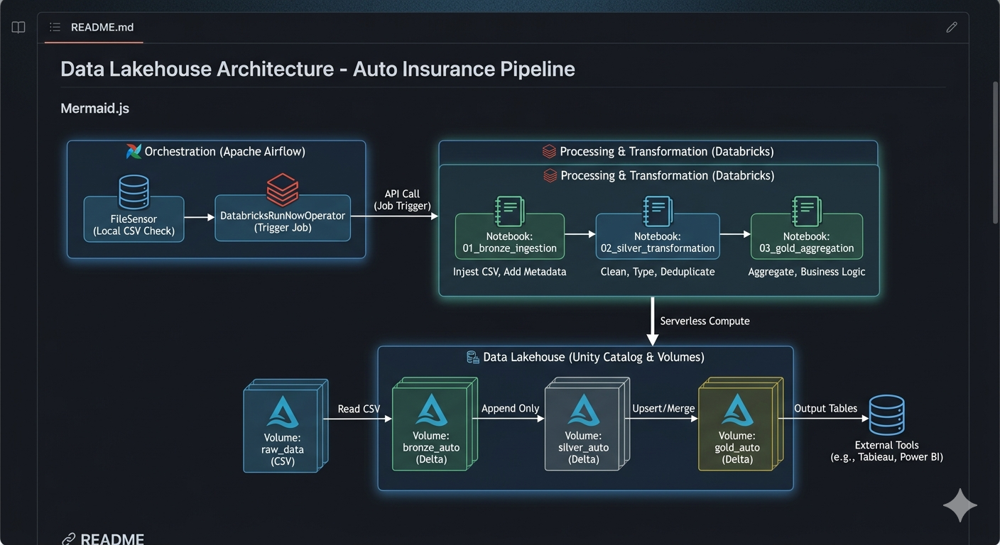

# 📌 Sommaire
- [Objectif du projet](#-objectif-du-projet)
- [Structure du projet](#-structure-du-projet)
- [Démarrer le projet](#démarrer-le-projet-airflow--databricks)
- [Schéma d’architecture](#schéma-darchitecture)
- [Pipeline Databricks](#--pipeline-databricks-bronze--silver--gold--résultats)
- [Data Quality](#-data-quality)
- [Orchestration Airflow](#-orchestration-airflow)
- [Configuration dynamique](#-configuration-dynamique-via-variables-airflow)
- [Configuration sécurisée](#-configuration-airflow-sécurisée)
- [Alertes Email](#-alertes-email-databricks-monitoring)
- [Stack technique](#-stack-technique)
- [Points forts](#-points-forts-du-projet)
- [Améliorations possibles](#--améliorations-possibles)


# Pipeline Assurance Auto – Databricks + Airflow  

### *Architecture moderne (Unity Catalog, Serverless, Bronze/Silver/Gold) orchestrée via Airflow*

Ce projet met en œuvre un pipeline Data Engineering complet, industrialisé et orchestré, basé sur :

- **Databricks Serverless** (Unity Catalog, Volumes, Delta Lake)  
- **Apache Airflow** (DAG dynamique, FileSensor, déclenchement de Job Databricks)  
- **Architecture Data Lakehouse** Bronze → Silver → Gold  
- **Configuration dynamique via Variables Airflow (sans modifier le code)** 
- **Observabilité et Gestion proactive des erreurs** 

Il illustre une architecture professionnelle utilisée dans les équipes Data Engineering modernes.

---

# 🎯 Objectif du projet

Ce projet simule un cas d’assurance pour démontrer **une maîtrise complète d’un pipeline Data Engineering moderne**, en reproduisant fidèlement les pratiques utilisées en entreprise : orchestration, gouvernance, traitement distribué, industrialisation et monitoring.

Il met en avant des compétences clés :

- Databricks (Unity Catalog, Volumes, Delta Lake, Serverless)
- Airflow (DAG dynamique, FileSensor, API Jobs)
- Architecture Data Lakehouse
- Orchestration de pipelines distribués
- Gestion d’environnements Dockerisés
- Bonnes pratiques d’industrialisation
- Monitoring, Observabilité et Gestion proactive des erreurs

Il constitue une base solide pour un pipeline de production dans un environnement Data Engineering moderne.

## Données

Les données proviennent d'un jeu de données d'assurance auto (Kaggle) couvrant le profil assuré, le véhicule et la sinistralité.

Lien du Dataset Kaggle :  
[Auto Insurance Dataset](https://www.kaggle.com/datasets/silvain/automobile-insurance/data)

---

# 📁 Structure du projet

```text
databricks-airflow-auto-insurance-pipeline/
├── airflow/
│   ├── dags/
│   │   └── databricks_auto_insurance_dag.py
│   ├── data/
│   │   └── Base_de_donnees.csv
│   └── requirements.txt
│
├── databricks/
│   ├── notebooks/
│   │   ├── 01_bronze_ingestion.py
│   │   ├── 02_silver_transformation.py
│   │   └── 03_gold_aggregation.py
│   └── volumes/  (créés automatiquement dans Databricks, non présents en local)
│       ├── raw_data/        (Unity Catalog Volume)
│       ├── bronze_auto/     (Unity Catalog Volume)
│       ├── silver_auto/     (Unity Catalog Volume)
│       └── gold_auto/       (Unity Catalog Volume)
│
├── docker-compose.yml
├── .env.example
├── .gitignore
|── docs/architecture.png
└── README.md
```
**Note** :  
Les dossiers **raw_data**, **bronze_auto**, **silver_auto** et **gold_auto** sont créés automatiquement dans Unity Catalog Volumes sur Databricks.
Ils n’existent pas dans le répertoire local et ne doivent pas être versionnés.

---

# Démarrer le projet (Airflow + Databricks)

1. Cloner le projet 
 - `git clone <repo>`
 - `cd databricks-airflow-auto-insurance-pipeline`
 - `cp .env.example .env`

2. Lancer Airflow (Docker) depuis la racine du projet :
 - `docker compose up -d`

3. Initialiser Airflow (à faire une seule fois):
 - `docker compose up airflow-init`

4. Accéder à Airflow
 - URL : http://localhost:8080
 - Identifiants : définis dans airflow-init (ex : admin / admin)

---

# Programmer l’exécution du pipeline (CRON)

Le DAG utilise une configuration dynamique via les Variables Airflow.

**Option A** — Modifier l’horaire via Airflow Variables (recommandé)

Changer l’heure d’exécution sans toucher au code :
 - `docker compose exec airflow-webserver airflow variables set AUTO_INSURANCE_DAG_SCHEDULE "40 20 * * *"`

Exemples :
 - Tous les jours à 20h40 → "40 20 * * *"
 - Tous les jours à 18h10 → "10 18 * * *"

**Option B** — Modifier l’horaire via .env (possible mais moins flexible)

changer dans .env:  
  - `AUTO_INSURANCE_DAG_SCHEDULE="40 20 * * *"`

Puis redémarrer Airflow :  
 - `docker compose down`

 - `docker compose up -d`

NB: La meilleure pratique est d'utiliser Airflow Variables (**Option A**) car :

  - On n'aura pas besoin de redémarrer Airflow
  - On n'aura pas besoin de modifier le fichier `.env`
  - On n'aura pas besoin de toucher au code
  - Airflow garde un historique des changements
  - C’est modifiable directement dans l’UI Airflow

---

# 🧱 Architecture technique

###  **Unity Catalog + Volumes**
Les données sont stockées dans des Volumes UC :

| Couche | Volume UC | Description |
|-------|------------|-------------|
| Raw | `workspace.default.raw_data` | CSV brut |
| Bronze | `workspace.default.bronze_auto` | Ingestion brute + métadonnées |
| Silver | `workspace.default.silver_auto` | Nettoyage, typage, dédoublonnage |
| Gold | `workspace.default.gold_auto` | Agrégations pour la BI |

Les répertoires suivants ne sont **pas présents en local**.  
Ils sont créés automatiquement dans **Unity Catalog Volumes** :

- `/Volumes/workspace/default/raw_data`
- `/Volumes/workspace/default/bronze_auto`
- `/Volumes/workspace/default/silver_auto`
- `/Volumes/workspace/default/gold_auto`

Ils servent de stockage Lakehouse pour les couches Raw → Bronze → Silver → Gold.

---

# Schéma d'architecture 

Ce schéma illustre le flux complet du pipeline : **Airflow orchestre**, **Databricks exécute**, **Unity Catalog stocke**.



---

#  Pipeline Databricks (Bronze → Silver → Gold) & Résultats

### **01_bronze_ingestion**
- Lecture du CSV depuis `raw_data`
- Ajout de colonnes techniques (timestamp, source)
- Écriture Delta dans `bronze_auto`

### **02_silver_transformation**
- Nettoyage des chaînes (trim)
- Normalisation des types
- Suppression des doublons
- Filtrage des lignes invalides
- Écriture Delta dans `silver_auto`

### **03_gold_aggregation**
- Agrégations régionales / départementales
- Fréquence de sinistres
- Coût moyen par sinistre
- Écriture Delta dans `gold_auto`(sous-dossiers `frequence_par_region`, `cout_moyen_par_region`)

Le pipeline génère :

- Fréquence de sinistres par région
- Coût moyen par sinistre
- Tables Delta exploitables pour BI

Exemple :
| Région | Fréquence | Coût moyen |
|--------|----------|-----------|
| IDF    | 0.12     | 1200€     |

---

# ✅ Data Quality

- Vérification des **valeurs nulles critiques** (NUM_POLICE, dates)
- Suppression des **doublons métier**
- Validation des types (dates, numériques)
- Contrôles métier (ex : montant sinistre > 0)

Extensible avec :
- Great Expectations
- dbt tests

Ces contrôles garantissent la **fiabilit**é des données avant leur exposition en couche Gold.

---

# 🛠️ Orchestration Airflow

Le DAG `auto_insurance_uc_databricks_pipeline` orchestre le flux de bout en bout :
1. **FileSensor**  
   Attend le fichier CSV dans : opt/airflow/data/Base_de_donnees.csv

2. **DatabricksRunNowOperator**  
Une fois le fichier détecté et disponible dans le Lakehouse, Airflow déclenche un **Job Databricks existant** (Serverless), qui exécute les notebooks Bronze → Silver → Gold.

**Important** :  
Airflow **ne copie pas le fichier vers Databricks**.
Databricks ne peut pas accéder au filesystem local d’Airflow (Docker).
Le fichier doit donc **être déposé dans le Volume Unity Catalog (raw_data)** via l’interface Databricks (Catalogue → Volume → Upload) pour être accessible au Job Databricks.
Ainsi, Databricks peut lire le **fichier depuis le Lakehouse**, tandis qu’Airflow assure uniquement **l’orchestration du pipeline**.

---

# ⚙️ Configuration dynamique via Variables Airflow *(aucune modification du code nécessaire)*

##  1. Définir le Job ID Databricks

- `docker compose exec airflow-webserver airflow variables set AUTO_INSURANCE_DATABRICKS_JOB_ID <JOB_ID_NUMERIQUE>`

Le Job ID se trouve dans Databricks :  
**Workflows → Jobs → Job → URL `/jobs/<ID>`**

---

##  2. Définir l’horaire d’exécution (CRON)

Exemple : exécuter tous les jours à **20h32 (heure de Paris)**

- `docker compose exec airflow-webserver airflow variables set AUTO_INSURANCE_DAG_SCHEDULE "32 20 * * *"`

---

##  3. Définir le fuseau horaire

- `docker compose exec airflow-webserver airflow variables set AUTO_INSURANCE_DAG_TIMEZONE "Europe/Paris"`

---

##  4. Vérifier les variables
- `docker compose exec airflow-webserver airflow variables get AUTO_INSURANCE_DAG_SCHEDULE`
- `docker compose exec airflow-webserver airflow variables get AUTO_INSURANCE_DAG_TIMEZONE`
- `docker compose exec airflow-webserver airflow variables get AUTO_INSURANCE_DATABRICKS_JOB_ID`

---

# 🔐 Configuration Airflow (sécurisée)

Airflow nécessite deux clés internes :

**AIRFLOW__CORE__FERNET_KEY** : chiffrement des connexions

**AIRFLOW__WEBSERVER__SECRET_KEY** : sécurisation des sessions web

Ces clés doivent être définies dans les variables d’environnement et placées dans un fichier `.env` (non versionné) :
 - `AIRFLOW__CORE__FERNET_KEY=...`
 - `AIRFLOW__WEBSERVER__SECRET_KEY=...`
Puis référencées dans docker-compose.yml par `env_file:  - .env`

NB: Ne jamais publier ces clés dans un dépôt public.

## 1. Pour générer une clé Fernet :
Dans Ubuntu ou sur Linux : `python -c "from cryptography.fernet import Fernet; print(Fernet.generate_key().decode())"`

## 2. Pour générer une clé secrète (à ajouter cette clé stable dans tous les services Airflow), vous avez deux options : 
  - Soit vous générez une clé unique via un terminal Linux  : ` python3 -c "import secrets; print(secrets.token_urlsafe(32))"`
  - Soit vous générez une clé aléatoire via un terminal Linux  : `openssl rand -hex 32`

## Connexion Databricks (obligatoire)

La tâche `DatabricksRunNowOperator` utilise la connexion Airflow `databricks_default`.

Renseigner dans `.env` :

- `DATABRICKS_HOST` : host workspace Databricks, sans `https://`
- `DATABRICKS_TOKEN` : Personal Access Token Databricks

Exemple :

- `DATABRICKS_HOST=adb-1234567890123456.7.azuredatabricks.net`
- `DATABRICKS_TOKEN=dapiXXXXXXXXXXXXXXXX`

Au démarrage `airflow-init`, la connexion `databricks_default` est créée automatiquement.

Vérification :

- `docker compose exec airflow-webserver airflow connections get databricks_default`

Le champ `host` ne doit pas être `localhost`.

---

# 📬 Alertes Email Databricks (Monitoring)

Les alertes email sont configurées directement dans le Job Databricks (Settings → Notifications).

Le Job Databricks est configuré avec des alertes email automatiques :
  - **Email en cas de succès**
  - **Email en cas d’échec**

Chaque notification contient :
  - Le Job ID
  - Le Run ID
  - Le Workspace
  - Le statut
  - Le timestamp
  - La durée d’exécution

Cela permet un monitoring complet du pipeline et une réactivité immédiate en cas d’incident.

---

#  Stack technique

- **Databricks Serverless**
- **Unity Catalog + Volumes**
- **Delta Lake**
- **PySpark**
- **Apache Airflow (Docker)**
- **FileSensor**
- **DatabricksRunNowOperator**
- **Variables Airflow dynamiques**
- **Docker Compose**

---

# ⭐ Points forts du projet

- Architecture **Lakehouse moderne** (UC + Volumes)
- Pipeline **Bronze / Silver / Gold** structuré et industrialisé
- Orchestration **Airflow → Databricks** via API Jobs
- Configuration **100% dynamique** via Variables Airflow
- Compatible **Serverless Compute**
- Monitoring, Observabilité et Gestion proactive des erreurs
- Projet **production-ready**, facilement extensible
- Parfait pour démontrer :
  - Data Engineering
  - MLOps / Orchestration
  - Industrialisation Databricks
  - CI/CD Airflow (optionnel)

---

#  Améliorations possibles
- Monitoring SLA Airflow
- Tests unitaires PySpark
- CI/CD GitHub Actions
- Dashboard Power BI / Databricks SQL